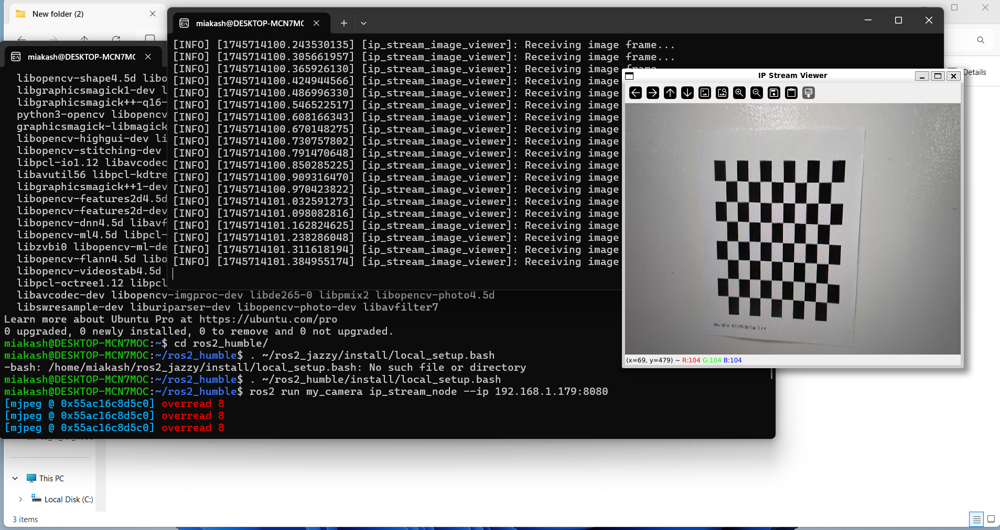

<h1>Assignment 3</h1>
<h2>Task 1: Camera Calibration (ROS)</h2>

<figure>
    <figcaption><strong>Capturing checkerboard using in ros2 and publishing as a topic</figcaption>
    
    
</figure>

<b> step1: Download to task_1_camera_calibration_ROS</b>
